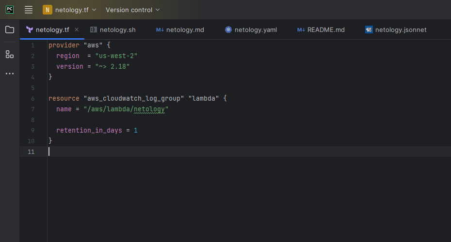
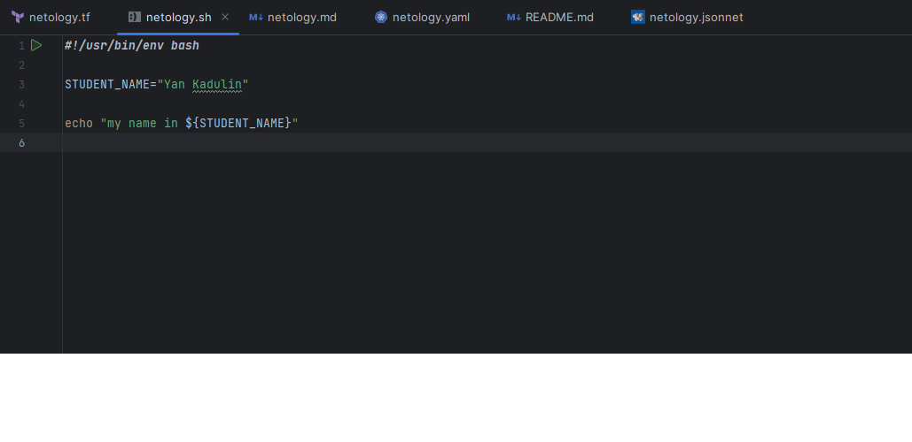
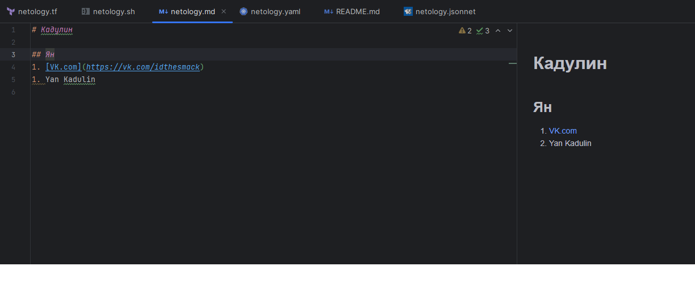
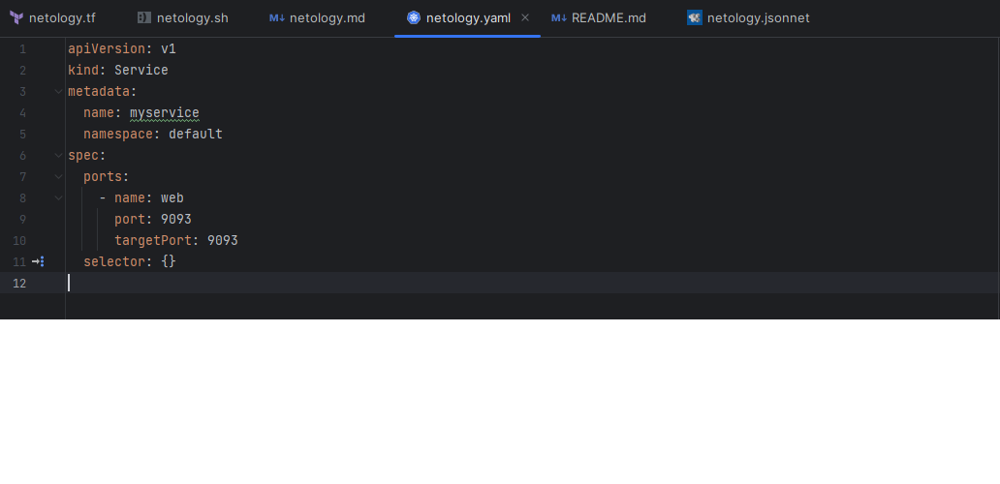
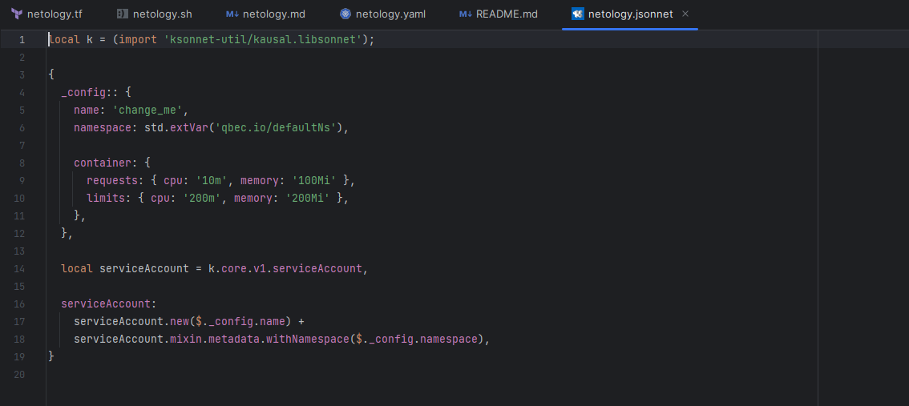

# Домашнее задание к занятию «Введение в DevOps»
     
## Задание 1. Подготовка рабочей среды

* [netology.tf](netology1.tf) — Terraform;
* [netology.sh](netology1.sh) — Bash;
* [netology.md](netology1.md) — Markdown; 
* [netology.yaml](netology1.yaml) — YAML;
* [netology.jsonnet](netology1.jsonnet) — Jsonnet.

* Terraform: 
* Bash: 
* Markdown: 
* Yaml: 
* Jsonnet: 

## Задание 2. Описание жизненного цикла задачи (разработки нового функционала)

Чтобы лучше понимать предназначение инструментов, с которыми вам предстоит работать, составим схему жизненного цикла задачи в идеальном для вас случае.

### Описание истории

Представьте, что вы работаете в стартапе, который запустил интернет-магазин. Он достаточно успешно развивался, и пришло время налаживать процессы: у вас стало больше конечных клиентов, менеджеров и разработчиков.

Сейчас от клиентов вам приходят задачи, связанные с разработкой нового функционала. Задач много, и все они требуют выкладки на тестовые среды, одобрения тестировщика, проверки менеджером перед показом клиенту. В некоторых случаях вам будет необходим откат изменений. 

### Решение

Для решения данной задачи, на мой взгляд предпочтительнее использовать методологию Agile так как, в условии не поставленна конкретная задача, необходимо сосредоточиться на мобильности и гибкости проекта. Я вижу следующие шаги:
1. Необходимо с помощью менеджера организовать анализ и сбор требований для разработки нового функционала;
2. С помощью проведенного анализа который помог составить требования, необходимо разработать техническое задание основываясь на методологии Agile(менеджер разбивает все собранные требования на спринты);
3. Frontend-разработчики разрабатывают дополнительные модуль в новой версии дизайна для дизайн-концепции интернет магазина благодоря т/з;
3. Backend-разработчики благодаря т/з пишут новую фукцию в новой версии для интернет магазина;
4. Тестировщики тестируют новую функцию:
   1. Юнит-тестирование;
   2. Интеграционное тестирование;
   2. Функциональное тестирование;
   3. E2E тестирование.
5. Я в роли DevOps-инженера произвожу вывод новой версии в продакшн и если будет необходимо осуществляю откат.
6. Техническая поддержка осуществляет обслуживание и фиксирует баги выявленные пользователями.
